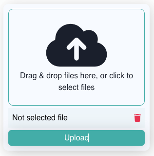

# Overview

This project allows Qodly Studio developers to use their own HTTP handlers to upload files to a server or send them to an S3 bucket (or similar services).


## Features

- **Customizable File Upload**: Easily configure the component to work with any backend service.
- **Drag and Drop Support**: Users can drag files directly into the DropZone for quick uploads.
- **Multiple File Selection**: Supports uploading multiple files at once.
- **File Type and Size Filtering**: Customize accepted file types and size limits to ensure valid uploads.

## Properties

| **Property Name** | **Type** | **Description**                                                                    |
| ----------------- | -------- | ---------------------------------------------------------------------------------- |
| **URL**           | `String` | The API endpoint or HTTP handler URL to which files are uploaded.                  |
| **Allowed Files** | `String` | Specifies the types of files allowed for upload (e.g., image/\*).                  |
| **File Limit**    | `Number` | Limits the number of files that can be uploaded. If set to `0`, there is no limit. |

## Events

| **Event Name**        | **Event data**    | **Description**                                       |
| --------------------- | ----------------- | ----------------------------------------------------- |
| **On Upload**         | File information  | Triggered when the upload process is initiated.       |
| **On Upload Success** | API response data | Triggered when the file upload is successful.         |
| **On Upload Failure** | API error message | Triggered when the file upload fails.                 |
| **On File Select**    | File information  | Triggered when a file or multiple files are selected. |
| **On File Remove**    | File information  | Triggered when a file is removed from the selection.  |

### How to Get Event Data

To access event data during an event, you can bind it to a function. Here’s an example:

```javascript
  var event : object
  var data : object

  event = webEvent
  data = event.data
```

For more information on working with event data, see the [Qodly web event documentation](https://developer.qodly.com/docs/language/commands/webEvent).



## Custom CSS

```CSS
/* General Styles for DropZone */
self .dropZoneHeader {
  flex: 1;
  width: 100%;
  border: 1px solid #43ada8;
  border-radius: 10px;
  display: flex;
  align-items: center;
  justify-content: center;
  flex-direction: column;
}

self .dropZoneHeader:hover {
  background-color: #43ada80F;
}

self .dropZoneHeader p {
  text-align: center;
}

self .dropZoneFooter {
  background-color: #43ada80F;
  width: 100%;
  height: 40px;
  padding: 8px;
  border-radius: 0px;
  cursor: pointer;
  display: flex;
  align-items: center;
  justify-content: space-between;
  color: black;
  border: none;
}


```

Feel free to adjust any part to better fit your project's specifics!
