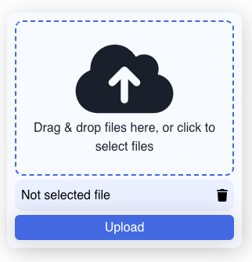

# Overview

This project allows Qodly Studio developers to use their own HTTP handlers to upload files to a server or send them to an S3 bucket (or similar services).



## Features

- **Customizable File Upload**: Easily configure the component to work with any backend service.
- **Drag and Drop Support**: Users can drag files directly into the DropZone for quick uploads.
- **Multiple File Selection**: Supports uploading multiple files at once.
- **File Type and Size Filtering**: Customize accepted file types and size limits to ensure valid uploads.

## Properties

| **Property Name** | **Type** | **Description**                                        |
| ----------------- | -------- | ------------------------------------------------------ |
| **URL**           | `String` | The API endpoint or HTTP handler URL for file uploads. |
| **Allowed Files** | `String` | .                                                      |

## Custom CSS

```CSS
/* General Styles for DropZone */
self {
  transition: border-color 0.3s ease, color 0.3s ease;
}

/* Styles when dragging files */
self.dragging {
  border-color: gray;
  color: gray;
}

/* Status Message */
self p {
  color: black;
  margin: 0;
  font-size: 20px;
  font-weight: 500;
}

/* Selected Files Section */
self .selected-files {
  margin-top: 20px;
  border-top: 1px solid #ddd;
  padding-top: 10px;
}

self .selected-files-title {
  font-size: 18px;
  font-weight: bold;
  color: #333;
}

self .selected-file {
  list-style: none;
  padding: 0;
  margin: 0;
}

self .selected-file-title {
  display: flex;
  justify-content: space-between;
  align-items: center;
  padding: 8px 0;
  border-bottom: 1px solid #eee;
}

self .selected-file-title:hover {
  background-color: #f5f5f5;
}

self .selected-file-icon {
  cursor: pointer;
  color: aqua;
  font-weight: bold;
}

/* Upload Button */
self .upload-files {
  margin-top: 20px;
}

self .upload-button {
  background-color: transparent;
  color: #007bff; /* Bootstrap primary color */
  border: 2px solid #007bff;
  border-radius: 4px;
  padding: 10px 15px;
  font-weight: 600;
  transition: background-color 0.3s ease, color 0.3s ease;
}

self .upload-button:hover {
  background-color: #007bff;
  color: white;
  border-color: transparent;
}

```

Feel free to adjust any part to better fit your project's specifics!
